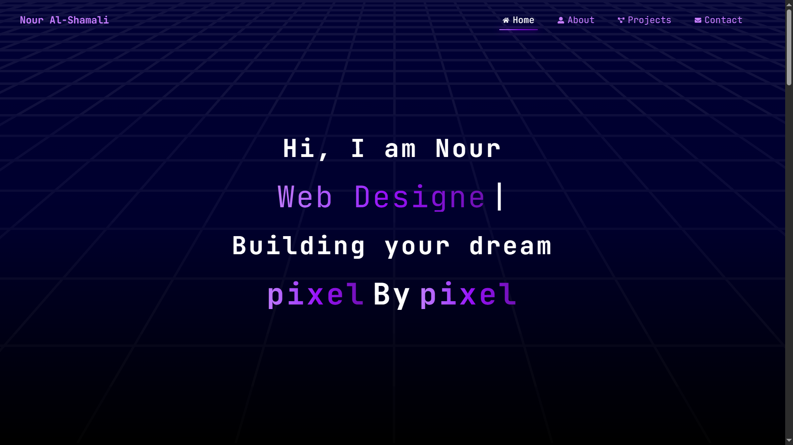

# 🌟 My Portfolio Project

This is my personal portfolio website built with **React** and **Tailwind CSS**, showcasing my projects, skills, and a responsive design. The site features smooth scrolling effects, interactive components, and modern UI design principles.


## 🚀 Features
- Responsive navigation bar with scroll effects
- Interactive UI components using React
- Utility-first styling with Tailwind CSS
- Animations with Framer Motion and React Icons

## 🛠️ Tech Stack
- **Frontend:** React, React Icons, Framer Motion
- **Styling:** Tailwind CSS
- **Build Tool:** Vite

## 📂 Project Structure
```bash
portfolio/
├── index.html
├── src/
│   ├── main.jsx
│   ├── App.jsx
│   ├── components/
│   └── pages/
├── vite.config.js
└── package.json
